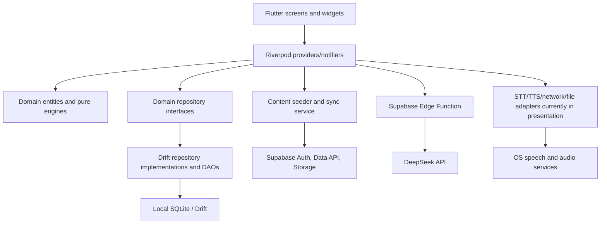
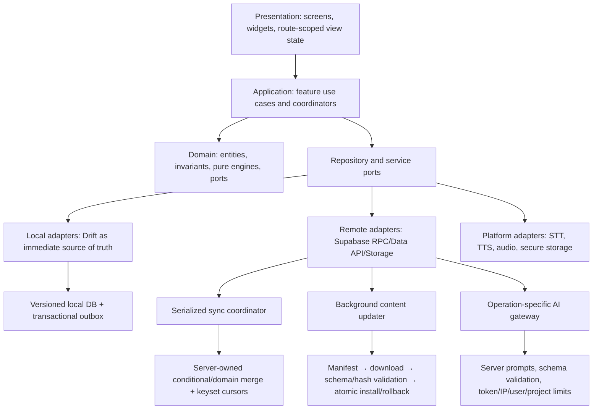

# Czechify — Code and Architecture Review

**Review date:** 20 July 2026  
**Reviewed branch:** `ux-learning-improvements`  
**Reviewed commit:** `4cc8bcadaa3e`  
**Scope:** Flutter/Dart application, Drift persistence, Riverpod state, Supabase schema/auth/sync/content, Edge Function, tests, CI, platform packaging, dependencies, documentation, and bundled curriculum/audio metadata.

## Executive decision

**Recommendation: hold a public/store production release.** The repository is a promising, analyzable prototype/private-beta baseline: the analyzer is clean, all 89 automated tests pass, the core domain engines are mostly pure, the local curriculum dataset is internally consistent, and the existing RLS policies have a sound owner-isolation shape. However, the current build has release-blocking mismatches between its privacy statements and runtime behavior, omits the active A2 lesson seed path, cannot provide the advertised cross-device behavior with per-install anonymous identities, can overwrite or strand synced state, exposes an abuse-prone paid AI proxy, and can silently produce an Android release signed with the debug key.

The highest-value direction is not a rewrite. Preserve the tested domain engines, repository interfaces, Drift schema, visual system, and curriculum assets. Introduce a small application layer, make Drift the immediate local source of truth, redesign content updates and sync as explicit coordinators, and close the release/compliance and testing gaps in staged pull requests.

### Maturity snapshot

| Area | Status | Summary |
|---|---|---|
| Domain algorithms | **Healthy foundation** | Pure scheduling, grading, normalization, pronunciation, and gamification logic is testable and has useful unit coverage. Several product-rule defects remain. |
| Flutter architecture | **Needs restructuring** | A recognizable presentation/domain/data split exists, but application orchestration and platform adapters are concentrated in Riverpod providers and very large widgets. |
| Local persistence | **Mixed** | Drift is opened off the UI isolate and has a migration test, but mutation/outbox writes are not atomic and key query/index/constraint coverage is incomplete. |
| Curriculum delivery | **Release risk** | Complete-pack presence is checked, but A2 lessons 16–22 are omitted by the active loader and releases are neither typed, version-atomic, nor rollback-safe. |
| Offline behavior | **Does not meet claim** | Every launch blocks on Supabase and a full reseed, even when valid local content already exists. |
| Auth and cloud sync | **Release risk** | RLS predicates are mostly good, but identity, conflict resolution, triggering, pagination, failure isolation, and new-project grants are incomplete. |
| Privacy and user controls | **Release blocker** | Shipped statements contradict automatic auth, cloud sync, Edge AI processing, and potentially cloud-backed OS speech recognition. No export/deletion flow was found. |
| AI boundary | **Release risk** | Secrets stay server-side and a quota exists, but the function accepts arbitrary role-tagged prompts and anonymous accounts are an inexpensive quota bypass. |
| Automated quality | **Insufficient for risk** | 89/89 tests and static analysis pass; whole-app integration, sync, content, RLS, Edge Function, accessibility, and platform paths are largely untested. |
| Delivery/platforms | **Needs hardening** | CI is minimal, dependency constraints lag, Windows cached audio is incomplete, and Android release signing falls back to debug. |

## Review method and limitations

The review combined source inspection, dependency and repository inventory, architecture/dependency tracing, static analysis, automated tests with coverage, format verification, curriculum referential-integrity checks, audio-manifest checks, and a static Supabase/Postgres security review.

Commands and checks run locally:

- `flutter analyze --fatal-infos`: **0 issues**.
- `flutter test --reporter expanded`: **89/89 passed**.
- `flutter test --coverage`: **89/89 passed**.
- LCOV: **13.0%** raw (`893/6,886`, generated Drift included); **22.0% of instrumented non-generated lines** (`446/2,031`). Forty-one of 99 non-generated Dart files were not loaded into coverage at all, so actual repository-wide production coverage is lower than 22%.
- `dart format --output=none --set-exit-if-changed lib test tool`: **87 of 116 files would change** in this run; the check did not mutate the worktree.
- Curriculum validation: **22 units, 44 lessons, 526 exercises, 481 vocabulary entries, 89 grammar rules**; no duplicate IDs or dangling unit/lesson references found.
- Audio validation: **1,482 manifest-referenced MP3 files**, with no missing references or orphan MP3s. The generation dry run expects 1,036 unique utterances per voice, while the manifest has 741 per voice, leaving **295 expected utterances per voice** to runtime fallback.
- `flutter pub outdated`: 19 constraints are older than the currently resolvable versions; important upgrade candidates are recorded below.
- Worktree remained clean before this report was added.

This was a static/local review. The Supabase CLI and Deno were not installed, so migrations, RLS policies, database advisors, and the Edge Function were not executed against a local or remote Supabase project. No production project was contacted. No device/simulator platform builds, network-failure injection, memory/CPU profiling, penetration test, store-review assessment, legal opinion, or Czech-language curriculum quality review was performed. Those are explicit follow-up gates, not implied passes.

## Current architecture

The intended dependency direction is recognizable: presentation uses domain contracts, and data implements them. The problem is the missing application/use-case layer—`lib/domain/usecases/` is empty—and the amount of orchestration retained in presentation. About 11,029 of 15,777 non-generated Dart lines, roughly 70%, are in `presentation`. Providers perform persistence sequencing, product rules, async concurrency control, sync startup, platform I/O, and error translation in addition to view state.

The principal consequences are:

- screen lifetime and asynchronous operation lifetime are not consistently tied together;
- the same product concept can acquire multiple sources of truth;
- persistence is often acknowledged in the UI before it is durable;
- infrastructure details leak through presentation and domain boundaries;
- unit tests cover pure engines but not the orchestration where most failure modes live.

## What is already working well

1. **The foundation is salvageable.** Repository contracts keep Drift out of most domain code, and `data` does not import `presentation`.
2. **Core logic is testable.** Grading, scheduling/planning, normalization, pronunciation, and gamification utilities are largely pure and already have useful unit tests.
3. **Drift initialization is sensible.** `NativeDatabase.createInBackground` keeps database opening off the UI isolate (`lib/data/database/database.dart:90`). Foreign-key enforcement is enabled.
4. **The sync outbox retains failed writes.** It only acknowledges a row after a successful remote write (`lib/data/sync/sync_service.dart:56-73`). The retry policy needs redesign, but the durability intent is correct.
5. **RLS ownership expressions are well-shaped.** User-table policies use `TO authenticated`, `(select auth.uid()) = user_id`, and both `USING` and `WITH CHECK` where applicable (`supabase/schema.sql:133-149`).
6. **The AI secret is server-side.** No DeepSeek secret was found in the Flutter client. The quota update is atomic, and function execution is revoked from `public`, `anon`, and `authenticated` before being granted to `service_role` (`supabase/schema.sql:81-107`).
7. **Content and storage exposure is narrow by intent.** Published curriculum is read-only to the client, and the audio bucket is configured for client reads rather than client writes.
8. **Remote pack presence is checked.** A visibly incomplete required pack set is rejected before seeding (`lib/data/content/curriculum_pack_source.dart:41-47`). This should evolve into release-manifest validation.
9. **Local content metadata is coherent.** The checked-in curriculum has no duplicate/dangling IDs, and every manifest audio reference exists.
10. **Lifecycle hygiene exists in several components.** Database/player/controllers/timers have several correct disposal patterns, and release logs suppress informational output.
11. **The visual foundation is coherent.** Theme tokens and adaptive mobile/desktop scaffolding give the UI a reusable base.

## Prioritized finding register

Priority meanings:

- **P0 — release blocker:** resolve before a public/store or paid production release.
- **P1 — high:** resolve before expanding beta or trusting cross-device/user data.
- **P2 — medium:** schedule in the next architecture/quality cycle.
- **P3 — hygiene:** address opportunistically or as part of adjacent work.

### P0 — release blockers

#### REV-001 — Privacy disclosures contradict runtime data flows

**Evidence.** `PRIVACY.md:9-31` and the in-app text at `lib/presentation/screens/settings/settings_screen.dart:295-311` say learning data is never transmitted, AI is off by default/directly uses a user key with no intermediary, and speech is processed entirely locally. In practice, startup initializes the production backend and automatically creates an anonymous Supabase identity (`lib/data/sync/backend_service.dart:43-67`), startup triggers sync (`lib/presentation/providers/sync_providers.dart:42-46`), progress/SRS/gamification rows are uploaded (`lib/data/sync/sync_service.dart:209-215`), and prompts are sent through a Supabase Edge Function to DeepSeek (`lib/data/repositories/supabase_llm_service.dart:18-34`, `supabase/functions/deepseek-proxy/index.ts:93-104`). OS-native speech recognition is not configured in a way that substantiates an always-on-device guarantee (`lib/presentation/providers/stt_providers.dart:77-90`).

**Impact.** The app gives users and store reviewers materially inaccurate information about processing, recipients, identity, and control. This is a release/compliance risk irrespective of whether individual identifiers are pseudonymous.

**Required action.** Build a real data inventory; align in-app and repository privacy text with anonymous auth, Supabase sync/storage, DeepSeek processing, retention, and OS speech behavior; add appropriate just-in-time consent/choice; add account/data export and deletion paths; document retention and subprocessors; update app-store disclosures; obtain product/legal review. Do not present this report as legal advice.

#### REV-002 — Active seeding omits every A2 lesson (Units 16–22)

**Evidence.** The active `_seedLessonsInBatches` uses `_lessonFilePaths` (`lib/data/seeds/content_seeder.dart:273-277`), but that list ends with Unit 15 (`:345-392`). The 14 Unit 16–22 lesson paths only exist in an unused retained method (`:138-211`). `requiredPackPaths` is also derived from the truncated active list (`:394-401`). The JSON files exist and passed referential-integrity validation.

**Impact.** Units 16–22 can be present while containing no seeded lessons. The remote snapshot can also omit those lesson packs without failing completeness validation.

**Required action.** Replace hand-maintained duplicate lists with a generated, schema-validated release manifest; immediately add Units 16–22 to the active required set; remove the obsolete method; add an integration test asserting 22 units, 44 lessons, two lessons per unit, and navigability of Unit 22.

#### REV-003 — The documented sync conflict contract is not implemented

**Evidence.** The schema and local table comments promise last-write-wins by newer `updated_at`, with `device_id` as tie-breaker (`supabase/schema.sql:3-11`, `lib/data/database/tables/sync_queue.dart:28-34`). The client instead performs an unconditional `.upsert()` (`lib/data/sync/sync_service.dart:209-215`), and no conditional merge trigger/RPC exists in `supabase/schema.sql`.

**Impact.** An older offline row can overwrite newer server state. Client wall-clock skew can dominate indefinitely. This is a data-loss/conflict defect, not merely an optimization.

**Required action.** Make conflict resolution server-owned and testable: a narrowly granted RPC or fully qualified trigger should conditionally update on `(logical_version, device_id)` or a server-issued revision. Prefer domain-specific merges for counters/sets where LWW is semantically wrong. Add two-device, skewed-clock, equal-timestamp, retry, and idempotency tests.

#### REV-004 — Cross-device sync has no cross-device identity

**Evidence.** The only authentication path found is `signInAnonymously()` (`lib/data/sync/backend_service.dart:56-59`). No sign-in, identity-linking, recovery, or account-transfer flow exists even though comments anticipate later linking.

**Impact.** Each installation receives a different `user_id`; rows protected by that identity cannot be shared across devices. Reinstall/device loss also severs access to synced state.

**Required action.** Either relabel the feature as single-install anonymous backup or implement a real identity lifecycle: opt-in account linking/sign-in, secure session recovery, reauthentication for destructive operations, anonymous-to-permanent migration, deletion/export, and documented behavior for reinstall/merge conflicts.

#### REV-005 — Local-only flashcards can poison SRS sync

**Evidence.** User-created flashcards allocate numeric IDs from a local `MAX`, beginning around 900000 (`lib/data/database/daos/vocabulary_dao.dart:44-52`, `lib/data/repositories/drift_vocabulary_repository.dart:80-106`). The flashcard content is not synced, but its SRS row is synced using that numeric foreign key (`lib/data/database/daos/vocabulary_dao.dart:98-128`). A second device can independently use the same ID for a different word or lack the flashcard entirely. Pull then attempts to merge the SRS row (`:134-166`); a missing local parent causes an FK failure, and the table cursor is not advanced (`lib/data/sync/sync_service.dart:100-125`).

**Impact.** One manual card can repeatedly fail and strand all subsequent SRS pulls for that table; ID collisions can associate reviews with the wrong content.

**Required action.** Use globally unique content IDs and sync user-created vocabulary and its SRS state as one aggregate, or make both explicitly device-local. Pull parent content before dependent state, quarantine invalid rows, and add two-device manual-card integration tests.

#### REV-006 — Edge Function is a generic paid LLM proxy that anonymous users can abuse

**Evidence.** The function accepts client-supplied `system`, `user`, and `assistant` roles and forwards messages verbatim (`supabase/functions/deepseek-proxy/index.ts:51-66,93-104`). Quota is keyed only by `user_id` (`:70-77`); anonymous accounts are cheap to mint. There is no operation allowlist, server-owned system prompt, `max_tokens` ceiling, token/cost budget, IP/device abuse control, or anomaly alert.

**Impact.** A modified client can use project spend for arbitrary inference and cycle anonymous identities to bypass the per-user daily count.

**Required action.** Accept operation/scenario IDs plus bounded user content, construct all privileged prompts server-side, validate a strict response schema, cap output/input tokens, add IP/project/device limits and anomaly alerts, and protect anonymous signup with CAPTCHA/Turnstile where appropriate. Preserve the existing atomic quota as one layer, not the only layer.

#### REV-007 — Android production builds can silently use the debug signing key

**Evidence.** When release keystore properties are absent, the `release` build type explicitly falls back to `signingConfigs.debug` (`android/app/build.gradle.kts:55-63`).

**Impact.** CI or a local release command can produce an artifact that is not store-upgradable or trustworthy as a production artifact, while still appearing to be a release build.

**Required action.** Fail the production release task when signing material is absent. If a local optimized build is needed, create a distinctly named non-production flavor. Add a CI assertion for certificate identity and artifact signing.

### P1 — high-priority correctness, data, and security

#### REV-008 — Startup is remote-required, not offline-first

`appInitializationProvider` waits for Supabase and seeding (`lib/presentation/providers/database_providers.dart:63-69`), `CurriculumPackSource` deliberately rejects stale/local content (`lib/data/content/curriculum_pack_source.dart:10-14,25-56`), the seeder refreshes every launch (`lib/data/seeds/content_seeder.dart:42-75`), and the router is withheld on failure (`lib/main.dart:33-49`). A transient outage prevents an existing learner from opening valid downloaded lessons.

**Action.** Open the app from the last verified local release immediately. Bundle or install a minimal bootstrap release, refresh in the background with stale-while-revalidate semantics, surface sync/content freshness non-blockingly, and retain a rollback-safe last-known-good version.

#### REV-009 — Content publication and installation are not release-atomic

The client selects only `pack_key,content`, ignoring `version` and `checksum` (`lib/data/content/curriculum_pack_source.dart:33-50`; columns at `supabase/schema.sql:112-121`). It validates presence rather than schemas/referential integrity, then commits units, grammar, lesson batches, vocabulary, and SRS in separate transactions (`lib/data/seeds/content_seeder.dart:55-73,273-343`). Upserts do not reconcile rows removed from a later release.

**Action.** Publish an immutable release manifest containing release ID, schema version, pack hashes, sizes, and required pack list. Download and validate all typed DTOs before mutation, stage in a shadow database/table set, atomically switch the active release, preserve user-owned state, reconcile deletions explicitly, and retain one rollback version.

#### REV-010 — Sync only runs once and can race startup

The only observed call is a fire-and-forget startup sync (`lib/presentation/providers/sync_providers.dart:42-46`). Mutations enqueue rows but do not trigger a worker; there is no connectivity, lifecycle-resume, periodic, or post-mutation drain. Pull can also race content installation. Pulled gamification is written to Drift while the displayed state loads from SharedPreferences (`lib/data/sync/sync_service.dart:141-185`, `lib/presentation/providers/gamification_providers.dart:57-94`).

**Action.** Introduce a single serialized `SyncCoordinator` that starts after local bootstrap, reacts to durable commits/connectivity/resume, debounces, exposes health, and owns cancellation. Establish one persisted source of truth per domain concept and refresh/invalidate relevant view state after pulls.

#### REV-011 — Local mutation and outbox enqueue are not atomic

Progress and SRS flows update domain tables and enqueue sync work in separate operations (`lib/data/database/daos/progress_dao.dart:23-63,91-104,200-209`; `lib/data/database/daos/vocabulary_dao.dart:98-128`).

**Impact.** A crash between the local write and enqueue permanently loses the cloud intent; the reverse order risks uploading a state not committed locally.

**Action.** Wrap aggregate mutation plus outbox insertion in one Drift transaction. Include an idempotency key, logical revision, operation kind, and serialized canonical payload in the outbox.

#### REV-012 — One poison outbox row blocks all later pushes

The push loop processes FIFO and stops at the first error (`lib/data/sync/sync_service.dart:56-73`). Attempts are counted, but there is no retry schedule, classification, maximum, or dead-letter/quarantine path (`lib/data/database/daos/sync_dao.dart:64-70`).

**Action.** Classify transient/permanent/auth/schema errors; add exponential backoff with jitter and `next_attempt_at`; quarantine permanent failures after a bounded attempt count; continue independent aggregates safely; surface a repairable sync-health state.

#### REV-013 — Pull cursors can skip or truncate rows

Pull filters with `updated_at > cursor`, orders only by timestamp, and performs no range pagination (`lib/data/sync/sync_service.dart:100-120`). Same-timestamp rows can be skipped after a partial result, and the Data API row cap can truncate a large table.

**Action.** Use stable keyset pagination with `(updated_at, primary_key)`, persist both cursor components only after a page commits, set explicit page sizes, and add `(user_id, updated_at, primary_key)` indexes matching each query.

#### REV-014 — New Supabase deployments lack explicit user-table grants

`supabase/schema.sql:123-131` grants curriculum access, and `:133-149` adds RLS policies for user tables, but it does not grant the authenticated role required DML privileges on those tables. Supabase's current new-project behavior no longer auto-exposes newly created tables to the Data/GraphQL APIs.

The deployment process compounds this risk: `supabase/README.md:6-16` asks operators to paste one snapshot into the SQL editor; no `supabase/migrations/` history exists; `CREATE TABLE IF NOT EXISTS` cannot evolve existing objects; the curriculum policy is not safely recreated; the script is not one transaction; and `supabase/config.toml` represents only the Edge JWT switch rather than local Auth/Storage/database parity.

**Action.** Add explicit least-privilege `GRANT SELECT/INSERT/UPDATE/DELETE` statements per authenticated table and corresponding sequence/function grants where needed, while retaining RLS. Convert the snapshot into ordered, transactional, repeatable migrations plus deterministic seed/publisher tooling; add a complete local configuration; verify `supabase db reset`; test role-level CRUD/RLS and rollback/restore in CI. The new-table default began in May 2026 and the announced existing-project enforcement date is 30 October 2026. See the official [Data API security guide](https://supabase.com/docs/guides/api/securing-your-api) and [breaking-change notice](https://supabase.com/changelog/45329-breaking-change-tables-not-exposed-to-data-and-graphql-api-automatically).

#### REV-015 — Chat operations have cross-session races and incomplete failure cleanup

`sendMessage` has no request ID, captured conversation epoch, cancellation, or serialization (`lib/presentation/providers/chat_providers.dart:147-203`). Reset/start during an in-flight call can append and persist an old response into a new conversation; start and greeting can race (`:118-143,232-270`). The first local save is outside the `try`, so it can leave loading stuck.

**Action.** Scope a controller per conversation, capture the conversation ID/request generation, cancel on reset/dispose, ignore stale completions, serialize greeting/send, and place all state cleanup in `finally`. Test reset/navigation/failure during every await.

#### REV-016 — SRS “Again” requeues stale state

The notifier persists `result.card` but appends the original `card` back to the session queue (`lib/presentation/providers/review_providers.dart:283-302`). The next rating is calculated from pre-review state. Persistence is fire-and-forget and errors are unhandled (`:285-289`).

**Action.** Requeue the updated card, await the transactional card/outbox write before advancing, model save failure explicitly, and regression-test repeated `Again` sequences.

#### REV-017 — Loading failures can produce permanent spinners

Lesson, review, and exam screens launch asynchronous initialization without a complete error state (`lib/presentation/screens/lesson/lesson_player_screen.dart:45-50`; `lib/presentation/screens/review/srs_review_screen.dart:27-30`; `lib/presentation/screens/exam/mock_exam_screen.dart:61-65`).

**Action.** Move route/session state to `AsyncNotifier.autoDispose.family` or an equivalent sealed `loading/data/error/saving` model; show retryable domain errors; cancel work on disposal; test repository exceptions.

#### REV-018 — Nullable `copyWith` fields cannot be cleared

Lesson and pronunciation state use `newValue ?? oldValue` for nullable fields (`lib/presentation/providers/lesson_providers.dart:70-111`; `lib/presentation/providers/pronunciation_providers.dart:25-40`). Calls such as `result: null` or feedback clears therefore preserve stale values (`lesson_providers.dart:235-254`; `pronunciation_providers.dart:59-70`).

**Action.** Use generated immutable state or an explicit sentinel/wrapper for nullable updates; add tests for clear/reset paths.

#### REV-019 — Settings and gamification have duplicate/racy sources of truth

Settings stores `settings_daily_goal_xp` (`lib/presentation/providers/settings_providers.dart:54-56,112-117`), while Home reads gamification's `gamification_daily_goal_xp` (`lib/presentation/providers/gamification_providers.dart:15,67-94`; `lib/presentation/screens/home/home_screen.dart:18,71-74`). Settings also begins an unawaited asynchronous load from a synchronous notifier (`settings_providers.dart:62-95`), so user writes can race late-loaded defaults. Pulled gamification uses yet another Drift path.

**Action.** Define one settings repository and one canonical persisted gamification aggregate. Use async initialization with readiness, validation, serialized/debounced persistence, fine-grained Riverpod selection, and explicit post-pull invalidation.

#### REV-020 — User-visible success precedes durable completion

Lesson completion launches persistence without awaiting it and marks the session complete immediately (`lib/presentation/providers/lesson_providers.dart:281-312`). Similar review writes are unawaited. Displayed per-exercise XP differs from the fixed XP awarded by `GamificationEngine` (`lesson_providers.dart:206-210`; `lib/domain/engines/gamification_engine.dart:23-31`).

**Action.** Make completion a single awaited transaction covering progress, gamification, and outbox; expose `saving/saved/retry` state; use one reward calculation contract and test the displayed/recorded result.

#### REV-021 — Speech-recognition lifecycle is not safely modeled

Callers cast the domain interface to `NativeSttService`; `stop()` does not settle the pending recognition future; some UI stop paths do not invoke service stop; global providers lack complete dispose cancellation; and async widget updates miss `mounted` checks (`lib/presentation/providers/stt_providers.dart:15-101`; `lib/presentation/providers/pronunciation_providers.dart:59-103`; `lib/presentation/widgets/lesson/exercise_widget.dart:884-930`). Repeated pronunciation submission can also deduct multiple hearts (`exercise_widget.dart:1103`; `lesson_providers.dart:190-225`).

**Action.** Define the required streaming/cancel lifecycle in the domain port, implement a single-operation state machine, settle futures exactly once, scope it to the route, cancel on dispose/navigation, disable/serialize submissions, and test timeout/stop/permission/navigation races.

#### REV-022 — Database invariants and indexes are underspecified

Remote scores, counts, state/card types, and identifiers have few range/enum/nonempty constraints (`supabase/schema.sql:16-75`). Pull paths lack matching composite indexes. Local SRS lacks uniqueness for logical flashcard/grammar identities and a due-date access index; common lesson/unit, exercise/lesson, flashcard/unit-or-lesson, chat/conversation, and progress access paths should be verified with query plans.

The `SECURITY DEFINER` quota function is sensibly revoked from client roles, but remains in the exposed `public` schema and sets `search_path = public` (`supabase/schema.sql:81-107`). Its table references are qualified, so this is hardening rather than a demonstrated exploit.

**Action.** Add constraints for valid ranges/enums/nonempty device IDs; unique logical keys; foreign-key indexes; and query-shaped composite indexes. Verify with representative `EXPLAIN (ANALYZE, BUFFERS)` data rather than indexing every column. Move privileged implementation into a private schema where practical, use an empty `search_path` with fully qualified references, and set explicit default privileges. Follow Supabase's guidance on [RLS and API security](https://supabase.com/docs/guides/database/postgres/row-level-security) and test both performance and authorization roles.

#### REV-023 — Production environment coupling increases operational risk

Production Supabase URL/publishable defaults are compiled into source (`lib/core/config/backend_config.dart:16-24`), and nine generated `supabase/.temp/` files—including linked project, project ref, pooler URL, and component versions—are tracked. A publishable key and project ref are not secrets, but a default production target makes accidental development writes, deployments, AI spend, and unsafe test execution more likely. `.gitignore` also lacks defensive `.env*`, function-secret, and Supabase temp rules. A secret scan found no committed DeepSeek/service-role/private key at review time.

**Action.** Add explicit dev/stage/prod flavors, environment-specific project refs and redirect URLs, CI-injected public configuration, separate data, and guardrails that make destructive/admin tooling refuse production unless intentionally selected. Untrack/ignore generated link state and secret-file patterns, and add secret scanning to CI.

### P2 — architecture, product correctness, and quality

#### REV-024 — Application and infrastructure responsibilities live in presentation

`lib/domain/usecases/` is empty. STT and a 369-line TTS network/file/cache implementation live under presentation (`lib/presentation/providers/stt_providers.dart`, `tts_providers.dart`). Grammar UI imports Drift types directly (`lib/presentation/screens/grammar/grammar_reference_screen.dart:3`), chat imports a data exception, and provider composition has circular imports between database and sync modules.

**Action.** Add thin feature use cases/controllers for lesson, review, chat, exam, settings, content update, and sync. Move OS/network/file adapters under infrastructure/data; return domain types/results; keep Riverpod as composition and view-state wiring rather than the business boundary. Enforce layer imports in CI.

#### REV-025 — Typed boundaries are missing for curriculum and AI output

Exercise payloads are runtime maps (`lib/domain/entities/exercise.dart:9`) and large widgets force-cast keys (`lib/presentation/widgets/lesson/exercise_widget.dart:189` and many peers). Published malformed content can pass presence checks and fail at render time. Writing result parsing does not require fields or clamp scores (`lib/presentation/providers/writing_providers.dart:25-38`). Chat history is unbounded, AI calls lack cancellation/timeout in the client, and user text is embedded into evaluator prompts.

**Action.** Introduce versioned JSON schemas and generated sealed DTOs for every exercise type and model response. Validate at publication and before installation. Use operation-specific structured output, score/range clamps, prompt/data separation, token budgets/history summarization, cancellation, and timeouts.

#### REV-026 — Several product rules are internally inconsistent

- Unit mastery divides by completed lessons rather than all unit lessons, so incomplete units can be marked mastered (`lib/data/repositories/drift_progress_repository.dart:58`; `lib/domain/engines/curriculum_tracker.dart:31`).
- Curriculum UI unlocks all lessons in an unlocked unit instead of using the existing prior-lesson rule (`lib/presentation/screens/curriculum/curriculum_screen.dart:260-305`; `curriculum_tracker.dart:8-28`).
- Full-heart state preserves an old refill clock, enabling an immediate refill after a later loss; fractional elapsed refill time is discarded (`lib/presentation/providers/gamification_providers.dart:175-190,270-272`).
- New-card daily budget is recorded when a review plan loads, not when a card is actually reviewed (`lib/presentation/providers/review_providers.dart:257-265`).
- Exam duration metadata and section totals disagree, and `maxScore` is unused (`lib/data/repositories/drift_exam_repository.dart:150` onward).

**Action.** Write product invariants as domain tests first, choose the intended rule with product/content owners, then move the rule to one domain/application implementation.

#### REV-027 — Exam implementation is sample-grade and has async races

The repository provides only a small hard-coded sample (two reading, two listening, one writing, one speaking task in `lib/data/repositories/drift_exam_repository.dart`). Finish can persist while writing/speaking evaluation is still active; late results then miss the saved score (`lib/presentation/screens/exam/mock_exam_screen.dart:152,358-377,640-651,754-772`).

**Action.** Label it clearly as practice/sample until an exam blueprint, content volume, timing, weighting, validation, and provenance are defined. Disable finish/navigation during required operations or cancel them explicitly; persist one finalized immutable attempt.

#### REV-028 — Routing and session scoping are fragile

Routes parse external path input with `int.parse`, have no robust route error page/redirect enforcement, and use a plain `ShellRoute` that discards tab-local state (`lib/presentation/routes/app_router.dart:34,67`). Global providers can outlive routes and retain work/state.

**Action.** Use typed/validated route parsing, onboarding/auth redirects, a router error surface, stateful indexed tab navigation where desired, and auto-disposed route-family controllers.

#### REV-029 — Accessibility and localization need a release pass

Interactive custom widgets use `GestureDetector` without button semantics/keyboard activation; several targets are under 48×48; the `faint` token has low measured contrast where used for small text; fixed Columns risk overflow at large text (`record_button.dart:21`, `srs_review_screen.dart:216`, `settings_screen.dart:453`, `app_theme.dart:143`, `pronunciation_screen.dart:41`, `lesson_player_screen.dart:521`). `lib/l10n/` is empty and presentation contains roughly 190 literal UI strings.

**Action.** Add semantic roles/labels, keyboard/focus behavior, minimum target sizing, contrast-compliant tokens, large-text/reflow tests, reduced-motion considerations, and Flutter localization resources. Test with TalkBack/VoiceOver and desktop keyboard, not only golden images.

#### REV-030 — Pronunciation scoring is not a phonetic assessment

The scorer aligns transcribed words by position, so one insertion shifts all subsequent words; “phoneme” output identifies sounds in low-scoring expected words rather than comparing actual phonemes (`lib/domain/engines/pronunciation_scorer.dart:45-126`). `PhonemeMapper` maps `ch` to `x` and later maps `x` to `ks` (`lib/core/utils/phoneme_mapper.dart:63` onward).

**Action.** Rename the feature to transcript similarity unless it is upgraded. For a real assessment, use word alignment/edit distance, Czech-aware grapheme/phoneme modeling, confidence handling, calibrated scoring, consent-aware audio handling, and evaluation against labeled Czech learner speech.

#### REV-031 — Error handling and observability are inconsistent

The typed exceptions in `lib/core/errors/app_exceptions.dart` are effectively unused and refer to stale Vosk/Whisper behavior. Many paths swallow errors or expose raw exception strings; startup maps broad failures to an internet message (`lib/main.dart:63` onward). No top-level Flutter/platform async capture or privacy-aligned crash telemetry was found.

**Action.** Define a domain failure taxonomy with user-safe messages and retryability, capture `FlutterError` and platform-dispatcher async errors, add structured redacted logs and opt-in/appropriately disclosed crash diagnostics, and expose sync/content version/last-success health without recording learner text.

#### REV-032 — Test coverage does not exercise the risky architecture

The 89 passing tests concentrate on pure engines. The widget smoke test is effectively empty (`test/widget_test.dart:4-6`); there is no `integration_test/`; and 41 of 99 non-generated source files never enter coverage. There are no meaningful sync, content-release, Edge Function, RLS, anonymous-to-linked auth, provider race, offline-start, accessibility, or platform-plugin integration suites. The migration test covers one synthetic v1-to-v4 path rather than immutable sequential schema snapshots.

**Action.** Prioritize risk coverage over a vanity percentage: two-device sync matrices, offline restart, outbox crash atomicity, poison/dead-letter behavior, content rollback/malformed packs, RLS role tests, Edge abuse/input tests, route/controller race tests, lesson/review/exam golden/widget flows, migration snapshots, and platform smoke tests. Ratchet meaningful non-generated line coverage from the current baseline toward 40%, then 60%, while requiring critical use cases to be near-complete.

#### REV-033 — CI is a minimal lint/unit-test job rather than a release gate

`.github/workflows/ci.yml:1-25` uses an unpinned `stable` Flutter channel on Ubuntu and runs only analyze/test. It does not enforce format, generated-code cleanliness, coverage, dependency/security review, Android release compilation, Apple/Windows builds, Supabase migration/RLS tests, Edge tests, or artifact signing. Actions are not commit-SHA pinned, and repository governance files such as `SECURITY.md`, `CODEOWNERS`, changelog/release process, and dependency automation were not found.

There is also no promotion-based release pipeline: no Android certificate assertion, iOS archive/TestFlight export automation, macOS distribution/notarization, Windows installer/MSIX signing, install smoke test, checksum, SBOM, provenance, or rollback workflow.

**Action.** Pin Flutter 3.44.2 initially and pin action SHAs; add least `permissions`, concurrency cancellation, timeouts, format and generated-diff gates, tests/coverage, Linux/Android plus macOS/iOS and Windows jobs, local Supabase/RLS/Edge tests, dependency/license/secret scanning, SBOM/provenance, and signed release artifacts. Add Dependabot/Renovate, promotion/rollback workflows, and explicit ownership/security reporting.

#### REV-034 — Platform behavior is not uniformly supported

The app depends on `just_audio` but not a Windows implementation, and generated Windows plugins do not contain one (`pubspec.yaml:24`; `windows/flutter/generated_plugins.cmake:5-12`). TTS always creates and uses an `AudioPlayer`, so cached/neural audio paths are not safely gated on Windows (`lib/presentation/providers/tts_providers.dart:70-86,303-305`). Microphone permissions exist on the principal mobile/Apple targets, but behavior still needs real-device validation.

Android also defines no `dataExtractionRules`/`fullBackupContent` exclusion while secure storage contains a supposedly installation-scoped sync device ID (`android/app/src/main/AndroidManifest.xml:6-9`; `lib/data/sync/device_id.dart:4-20`). Restored encrypted preferences can fail key unwrapping and can violate the intended reinstall identity lifecycle.

**Action.** Add a supported Windows audio backend or explicitly gate/disable that feature with a tested fallback. Define and test Android backup exclusions (or deliberately disable backup) for secure preferences. Establish a platform capability matrix and run install/start/audio/STT/storage/backup-restore/deep-link smoke tests on every advertised target.

#### REV-035 — Dependencies and formatting need a controlled modernization pass

Resolved direct upgrades include Drift `2.31.0 → 2.34.2`, Riverpod `3.0.3 → 3.3.2`, secure storage `9.2.4 → 10.3.1`, GoRouter `14.8.1 → 17.3.0`, Just Audio `0.9.46 → 0.10.6`, and `sqlite3_flutter_libs 0.5.42 → 0.6.0+eol`. Dev upgrades include Drift Dev `2.31.0 → 2.34.4`, Flutter Lints `4 → 6`, and SQLite `2.9.4 → 3.5.0`. A transitive `js` package is discontinued. Most source/test files fail the current format check.

The Edge import floats across all Supabase JS 2.x versions (`supabase/functions/deepseek-proxy/index.ts:1`) and has no Deno lock/import map. The broad Dart `supabase_flutter: ^2.5.0` constraint currently resolves to 2.16.0, but code uses newer `publishableKey` behavior, making an old lock resolution risky.

**Action.** First migrate from the end-of-life native-libraries package as part of SQLite 3.x following the official [`sqlite3_flutter_libs` notice](https://pub.dev/packages/sqlite3_flutter_libs) and [`sqlite3` changelog](https://pub.dev/packages/sqlite3/changelog). Then upgrade one ecosystem at a time—Drift/SQLite, Riverpod, GoRouter, secure storage, audio—each with migration notes, generated-code refresh, platform builds, and focused regression tests. Set an accurate minimum Supabase Flutter constraint, exactly pin/lock the Edge dependency, use lockfile-enforced installs, and test the current Supabase signing-key/Edge-auth path before key rotation. Apply formatting in a dedicated mechanical commit to keep behavioral reviews readable.

#### REV-036 — Architecture and product documentation describe a different system

`ARCHITECTURE.md` still describes Hive, `dart-fsrs`, Vosk/Whisper, a 21-unit path, direct user API keys, and other unimplemented/removed designs (for example `:51,79,175,588,716,784-818`). The repository actually uses Drift, a custom scheduler, OS speech, 22 units, anonymous Supabase auth, and an Edge AI gateway. README test/content counts are also stale. `sync_service.dart:9-15` calls itself upward-only even though it pulls.

**Action.** Replace speculative architecture with an as-built system/context/container view, architecture decision records for offline content/auth/sync/AI, a data-flow/privacy inventory, support matrix, deployment/runbook, and generated content/test metrics where possible.

### P3 — focused maintainability and performance debt

#### REV-037 — Large files concentrate unrelated responsibilities

| File | Non-generated lines | Main concern |
|---|---:|---|
| `lib/presentation/widgets/lesson/exercise_widget.dart` | 1,504 | Dispatches and implements many exercise types, speech lifecycle, validation, feedback, and layout. |
| `lib/presentation/screens/exam/mock_exam_screen.dart` | 1,056 | Timer, four section UIs, AI/STT, grading, persistence, and result navigation. |
| `lib/presentation/screens/review/srs_review_screen.dart` | 904 | Session UI and many review variants/components. |
| `lib/presentation/screens/chat/chat_screen.dart` | 616 | Conversation UI, speech input, messages, and composition behavior. |
| `lib/presentation/screens/lesson/lesson_player_screen.dart` | 602 | Loading, teaching, exercise, completion, and navigation states. |
| `lib/presentation/screens/stats/stats_screen.dart` | 568 | Multiple analytics sections and visualizations. |
| `lib/data/seeds/content_seeder.dart` | 523 | Parsing, validation, insertion, SRS creation, plus duplicate obsolete loader. |
| `lib/presentation/providers/gamification_providers.dart` | 463 | State, clocks, storage, rewards, badges, and product rules. |

**Action.** Split by feature responsibility after behavior is protected: one typed renderer/controller per exercise, one exam-attempt controller plus section widgets, one review controller plus card variants, and separate content parser/validator/installer. Set review heuristics rather than a rigid line limit.

#### REV-038 — Avoidable work exists on hot/startup paths

The full curriculum is downloaded and rewritten every launch, missing SRS cards are inserted one at a time (`lib/data/seeds/content_seeder.dart:498` onward), and the entire 1,056-line exam screen rebuilds every timer tick (`lib/presentation/screens/exam/mock_exam_screen.dart:88`).

**Action.** Version-check before download, install only a new release, batch SRS creation, isolate timer state/widget rebuilds, and profile startup/frame/build/database timings on representative low-end devices before and after changes.

#### REV-039 — Audio coverage is incomplete relative to the generator

The checked manifest is internally valid—741 entries for each of two voices and all 1,482 MP3s exist—but the dry-run generator identifies 1,036 unique utterances, leaving 295 per voice without a cached asset.

**Action.** Decide whether fallback TTS is intentional. If not, make audio generation/completeness a content-release gate. If yes, document the capability/network/platform fallback and track cache-hit ratio without collecting learner content.

#### REV-040 — Repository, licensing, and product packaging hygiene is incomplete

No root `LICENSE`/`NOTICE` accompanies the open-educational-software description or bundled font files; no `SECURITY.md`, `CONTRIBUTING.md`, `CHANGELOG.md`, CODEOWNERS, incident guide, or vulnerability-reporting channel exists. Platform names/metadata remain inconsistent and several launcher icons appear to be Flutter defaults. Settings hard-codes version `1.0.0` rather than reading package metadata (`lib/presentation/screens/settings/settings_screen.dart:261-265`). The repository also tracks 1,484 audio assets (about 23 MB) while distributing them through object storage, which deserves an explicit Git/LFS/artifact retention decision.

**Action.** Establish licensing and third-party notices, contributor/security/release governance, product icons/names/metadata, build-derived version display, and a deliberate binary-asset strategy. Do not rewrite Git history merely to optimize size without a separately approved migration plan.

## Target architecture

### Boundary rules

1. Presentation depends on application state/use cases and domain view models, never Drift rows, Supabase clients, files, or concrete platform services.
2. Application services own transaction boundaries, serialization, cancellation, retries, and cross-repository workflows.
3. Domain remains Flutter-, Riverpod-, Drift-, Supabase-, and `dart:io`-independent.
4. Drift is the immediate read source; cloud operations reconcile in the background and never gate access to a previously verified local release.
5. User mutation plus outbox intent is one local transaction. Server merge semantics are explicit, versioned, idempotent, and tested.
6. Content is immutable by release, typed before installation, hash-verified, atomically activated, and rollback-capable.
7. AI endpoints expose product operations, not a generic model proxy. The server owns privileged prompts and budgets.
8. Every long-running operation is route/session scoped, cancellable, generation-checked, and represented by explicit async state.

## Improvement and upgrade plan

The schedule below assumes one experienced Flutter engineer with part-time backend/product support. Parallel ownership can shorten elapsed time, but acceptance criteria should not be compressed.

### Phase 0 — production safety and truthfulness (2–5 engineering days plus policy review)

1. Freeze public release promotion.
2. Correct privacy/data-flow text and store disclosures; decide consent, deletion/export, retention, and anonymous identity policy.
3. Fix active Unit 16–22 lesson manifest/seeding and add a content-count integration test.
4. Make Android production release fail without the expected signing certificate.
5. Disable arbitrary role-tagged AI requests; impose server-owned operations and hard token/output limits as an immediate cost guard.
6. Add explicit authenticated table grants and validate a fresh Supabase deployment.
7. Split dev/stage/prod configuration so tests and developer tooling cannot default to production.

**Exit criteria:** disclosures match observed traffic; a fresh production-like environment migrates; 22/44 content is installed and navigable; an unsigned/mis-signed release fails; the AI endpoint cannot be used as a generic chat proxy.

### Phase 1 — data correctness and offline operation (2–3 weeks)

1. Bootstrap immediately from Drift/last-known-good content and move refresh after app launch.
2. Introduce a versioned content manifest, typed validators, staged atomic install, deletion reconciliation, and rollback.
3. Choose/implement the identity lifecycle or remove the multi-device promise.
4. Implement transactional mutation + outbox, a serialized lifecycle/connectivity sync coordinator, backoff/dead-letter handling, keyset pagination, and server-owned merge semantics.
5. Resolve the user-flashcard/SRS aggregate design and global IDs.
6. Consolidate settings/gamification sources and ensure pull updates reach live UI.
7. Fix SRS requeue, chat/exam/STT races, nullable clears, duplicate submissions, durable completion, mastery/unlock, and heart-clock rules.

**Exit criteria:** the app starts and teaches during backend outage; two-device deterministic tests pass under delay/retry/skew; no mutation can commit without its outbox; one poison row does not block unrelated work; content install is all-or-nothing; all P1 correctness regression tests pass.

### Phase 2 — application boundary and typed state (2–4 weeks, feature-by-feature)

1. Add feature-scoped application controllers/use cases; start with lesson, review, chat, and sync because they carry the highest race/data risk.
2. Move STT/TTS/cache/Supabase composition to infrastructure adapters and expand domain ports to actual lifecycle needs.
3. Replace dynamic exercise/model maps and hand-written nullable state with generated sealed DTO/state.
4. Split oversized screens/widgets along controller and exercise/section boundaries.
5. Add typed routing, route-family auto-disposal, redirects, and error surfaces.
6. Update the as-built architecture, ADRs, data inventory, and support matrix alongside each boundary change.

**Exit criteria:** enforced dependency rules pass; presentation has no direct Drift/Supabase/file/platform implementation imports; route/session operations cancel cleanly; published content and AI output are schema-validated before use.

### Phase 3 — verification, platform, and dependency modernization (2–3 weeks)

1. Build the integration suites listed in REV-032, with priority on sync/content/RLS/Edge and lifecycle races.
2. Expand CI to format, generated drift, coverage ratchet, Supabase local tests, Edge tests, and platform build/smoke matrices.
3. Migrate SQLite/Drift first, then Riverpod, GoRouter, secure storage, and audio in separate PRs.
4. Add or explicitly gate Windows audio; validate permissions, offline mode, STT/TTS, secure storage, and deep links on each advertised platform.
5. Add accessibility/large-text/keyboard/screen-reader checks and localization infrastructure.

**Exit criteria:** required CI is reproducible on pinned toolchains; production artifacts build/sign on supported targets; no EOL SQLite native-libs package remains; critical workflows are integration-tested; accessibility blockers are closed.

### Phase 4 — operational readiness and continuous improvement (ongoing)

1. Add redacted crash/error reporting, sync health, content version/install metrics, AI latency/cost/abuse alerts, and release dashboards.
2. Establish SLOs: offline startup success, sync convergence time, content install/rollback success, crash-free sessions, AI error/cost rate.
3. Add dependency automation, threat/privacy review cadence, content publication checks, SBOM/provenance, release notes, rollback drills, and incident runbooks.
4. Profile startup, frame rendering, database queries, battery, and audio cache on representative low-end hardware; optimize from measurements.

## Suggested pull-request sequence

| PR | Scope | Depends on |
|---|---|---|
| 1 | Privacy/data-flow inventory, temporary accurate disclosures, production config guardrails | Product/legal decisions |
| 2 | A2 manifest fix, remove duplicate loader, content-count/schema tests | None |
| 3 | Android signing fail-fast and pinned baseline CI format/generated checks | None |
| 4 | AI operation allowlist, server prompts, response schema, token/rate protections, tests | Backend policy |
| 5 | Explicit Supabase grants, constraints/indexes, fresh migration + RLS tests | None |
| 6 | Local-first startup and content release manifest/staging/rollback | PR 2 |
| 7 | Canonical settings/gamification persistence and product-rule fixes | None |
| 8 | Transactional outbox and server merge RPC/revision contract | PR 5 |
| 9 | Sync coordinator, pagination, retry/dead-letter, manual-card aggregate | PR 8 |
| 10 | Route-scoped async controllers for chat/review/lesson/exam/STT | PR 7 |
| 11+ | Feature-by-feature typed DTO/state and widget decomposition | PRs 6 and 10 |
| Final | Platform matrix, dependency majors, accessibility/localization, release observability | Stable behavior suite |

## Verification matrix for the next release candidate

| Gate | Required evidence |
|---|---|
| Privacy | Approved, accurate data-flow inventory; in-app/store disclosures; consent/control behavior; deletion/export and retention verification. |
| Content | Signed/versioned manifest; schema/hash validation; 22 units/44 lessons; failed install rollback; offline last-known-good launch. |
| Sync | Two-device identity; transactional outbox; idempotency; skew/conflict/retry/pagination/poison/manual-card tests; convergence dashboard. |
| Supabase | Fresh local deployment; explicit grants; anon/auth/service role matrix; RLS negative tests; query plans/advisor review. |
| AI | Operation allowlist; server-owned prompts; strict schemas; token/user/IP/project limits; anonymous abuse tests; timeout/cancellation; cost alerts. |
| Flutter behavior | Lesson/review/chat/exam happy, failure, navigation, cancellation, and process-restart flows; no stale completion or duplicate rewards. |
| Database | Fresh install plus every sequential migration snapshot; foreign keys/invariants; downgrade/rollback policy; representative query plans. |
| Platforms | Signed Android release; iOS/macOS/Windows builds as advertised; permission, STT/TTS/audio/storage/deep-link smoke tests on real devices. |
| Accessibility | Screen-reader, keyboard, focus, 200% text/reflow, contrast, target-size, and reduced-motion checks. |
| Delivery | Pinned reproducible CI; format/generated clean; coverage ratchet; dependency/license/secret scans; signed artifacts/SBOM/provenance. |

## Go/no-go checklist

Do not call the app production-ready until all P0 findings are closed and independently verified. A public beta should additionally require REV-008 through REV-021 to be closed or an explicit product decision that disables the affected feature. Production should require the full verification matrix, a real staging soak, monitored rollback, and no unresolved high-severity privacy, data-integrity, auth/RLS, signing, or AI-cost findings.

## Current external references used for upgrade/security guidance

- Supabase, [Securing your Data API](https://supabase.com/docs/guides/api/securing-your-api)
- Supabase, [Row Level Security](https://supabase.com/docs/guides/database/postgres/row-level-security)
- Supabase, [Tables are not exposed automatically — breaking change](https://supabase.com/changelog/45329-breaking-change-tables-not-exposed-to-data-and-graphql-api-automatically)
- Supabase, [Anonymous sign-ins and CAPTCHA guidance](https://supabase.com/docs/guides/auth/auth-anonymous)
- Supabase, [Edge Function rate-limiting example](https://supabase.com/docs/guides/functions/examples/rate-limiting)
- Supabase, [Edge Function authentication patterns](https://supabase.com/docs/guides/functions/auth)
- Supabase, [JWT signing-key migration](https://supabase.com/docs/guides/auth/signing-keys)
- Supabase, [Edge Function 401 and asymmetric-key guidance](https://supabase.com/docs/guides/troubleshooting/edge-function-401-error-response)
- Supabase, [Edge Function secrets](https://supabase.com/docs/guides/functions/secrets)
- Dart package registry, [`sqlite3_flutter_libs` end-of-life notice](https://pub.dev/packages/sqlite3_flutter_libs)
- Dart package registry, [`sqlite3` 3.x changelog](https://pub.dev/packages/sqlite3/changelog)

---

This report records observed code behavior at commit `4cc8bcadaa3e`. Findings should be converted into tracked issues with an owner, target release, testable acceptance criteria, and links to the implementing PRs. Re-run the review after Phase 1 because the sync/content/identity redesign will materially change the threat model and architecture.
